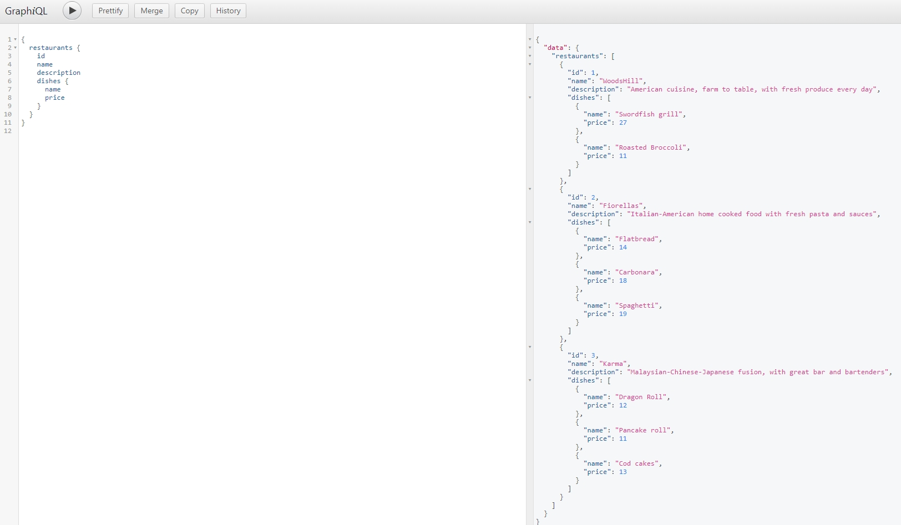
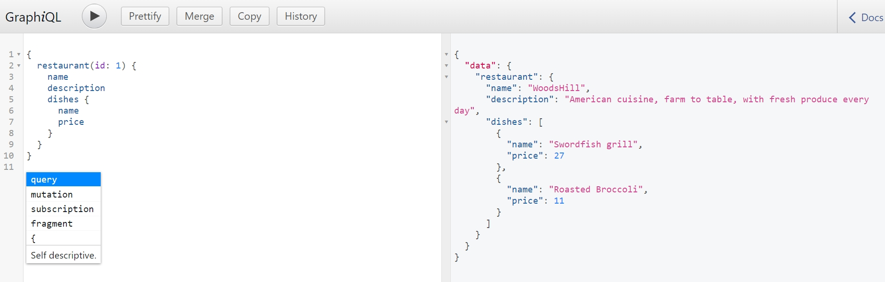
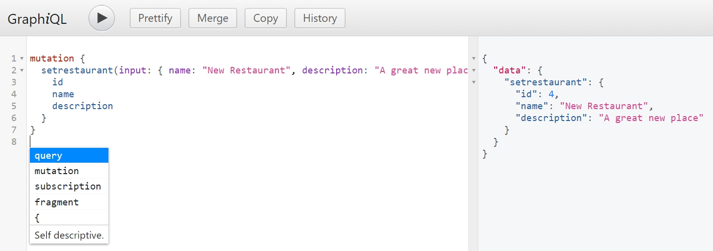
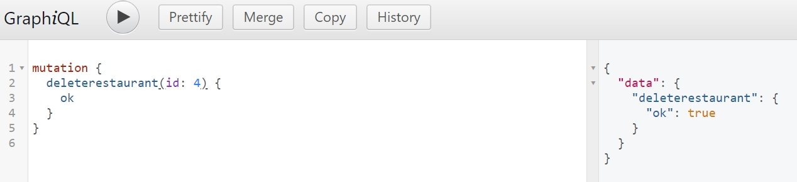
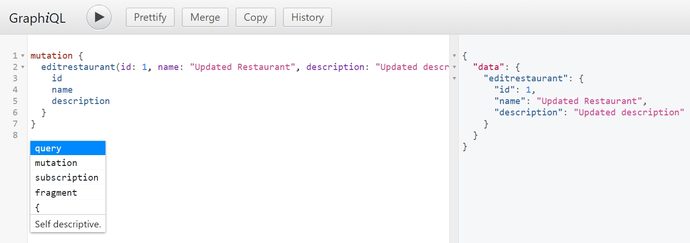
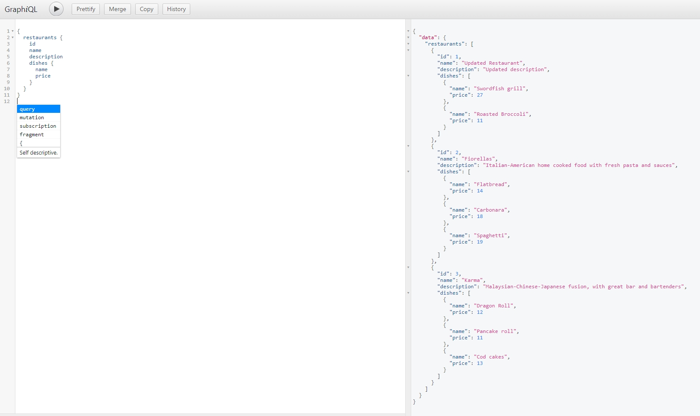

# Personal Programming Training Project: GraphQL Restaurant API

This project is a personal programming exercise aimed at learning and practicing GraphQL, Express, and Node.js. The project implements a simple GraphQL API that provides restaurant data, including information on the restaurant's name, description, and menu items. The API also supports basic operations (queries and mutations) for managing restaurant data.

## Table of Contents
- [Personal Programming Training Project: GraphQL Restaurant API](#personal-programming-training-project-graphql-restaurant-api)
  - [Table of Contents](#table-of-contents)
  - [Introduction](#introduction)
  - [Features](#features)
  - [Technologies Used](#technologies-used)
  - [Installation](#installation)
  - [Usage](#usage)
    - [Available Queries](#available-queries)
    - [Available Mutations](#available-mutations)
  - [Screenshots](#screenshots)
    - [1. Query All Restaurants](#1-query-all-restaurants)
    - [2. Query Restaurant by ID](#2-query-restaurant-by-id)
    - [3. Mutation: Add a New Restaurant](#3-mutation-add-a-new-restaurant)
    - [4. Mutation: Delete a Restaurant](#4-mutation-delete-a-restaurant)
    - [5. Mutation: Edit a Restaurant's Name](#5-mutation-edit-a-restaurants-name)
    - [6. Result](#6-result)
  - [Learning Objectives](#learning-objectives)
  - [Acknowledgments](#acknowledgments)

## Introduction

This project is built to practice the following skills:
- Understanding and implementing a GraphQL API.
- Using Express as a web server.
- Handling HTTP requests and responses in a Node.js environment.
- Structuring GraphQL queries and mutations.
- Manipulating mock restaurant data (CRUD operations).

The project provides a GraphQL API for managing a collection of restaurants and their dishes. Users can query the API for restaurant details, add new restaurants, delete restaurants, and modify existing restaurant data.

## Features

- **GraphQL API** with defined queries and mutations.
- **Restaurant Data Management**:
  - Query for all restaurants.
  - Query for a single restaurant by ID.
  - Add a new restaurant.
  - Delete a restaurant.
  - Edit an existing restaurant's details.
- Simple and easy-to-understand code, perfect for learning GraphQL basics.
- Interactive GraphiQL interface for testing the API.

## Technologies Used

- **Node.js**: JavaScript runtime for building server-side applications.
- **Express**: Minimalist web framework for Node.js to serve the GraphQL API.
- **GraphQL**: Query language for APIs to manage restaurant data.
- **express-graphql**: Middleware for integrating GraphQL with Express.
- **GraphiQL**: In-browser IDE for writing, validating, and testing GraphQL queries and mutations.

## Installation

To set up the project locally, follow these steps:

1. **Clone the Repository**:
   ```bash
   git clone https://github.com/your-username/graphql-restaurant-api.git
   cd graphql-restaurant-api

2. **Install Dependencies**: Ensure you have Node.js installed. Then, run the following command to install the necessary packages:
```bash
npm install
```

3.**Run the Server**: After installation, you can start the server using:
```bash
node index.js
```

4.**Access the GraphQL API**: Open your browser and navigate to:
```bash
http://localhost:5500/graphql
```

This will open the GraphiQL interface, where you can interact with the GraphQL API.

## Usage

### Available Queries

1. **Get all restaurants**:
```graphql
query {
  restaurants {
    id
    name
    description
    dishes {
      name
      price
    }
  }
}
```

2. **Get a single restaurant by ID**:
```graphql
query {
  restaurant(id: 1) {
    id
    name
    description
    dishes {
      name
      price
    }
  }
}

```

### Available Mutations

1. **Add a new restaurant**:                  
```graphql
mutation {
  setrestaurant(input: { name: "New Restaurant", description: "Fusion cuisine" }) {
    name
    description
  }
}
```

2. **Delete a restaurant**:
```graphql
mutation {
  deleterestaurant(id: 3) {
    ok
  }
}
```

3. **Edit an existing restaurant's details**:
```graphql
mutation {
  editRestaurant(id: 1, name: "Updated Restaurant Name", description: "Updated description of the restaurant") {
    id
    name
    description
  }
}
```

## Screenshots

### 1. Query All Restaurants


### 2. Query Restaurant by ID


### 3. Mutation: Add a New Restaurant


### 4. Mutation: Delete a Restaurant


### 5. Mutation: Edit a Restaurant's Name


### 6. Result


## Learning Objectives
This project was built to achieve the following learning outcomes:

- Understand GraphQL fundamentals: Learn how to define schemas, queries, and mutations in GraphQL.
- Develop a basic Express server: Understand how to serve a GraphQL API using express-graphql.
- Practice CRUD operations in GraphQL: Learn how to manipulate data with GraphQL queries and mutations.
- Use GraphiQL: Get hands-on experience with GraphiQL to explore and test the API.
- Mock data usage: Practice using mock data (restaurants and dishes) to simulate a real database.

## Acknowledgments
This project is purely for personal programming training. It is not a production-level application but rather a simple example to help understand how to use GraphQL with Express.

Feel free to fork the repository and modify it for your own learning purposes!